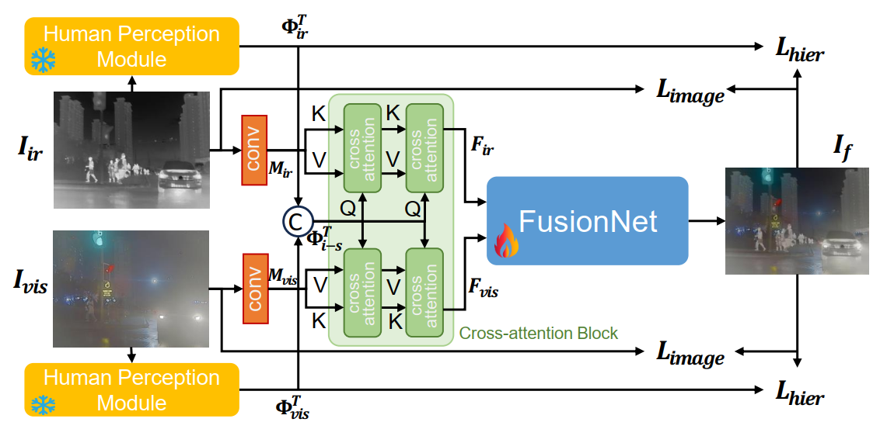
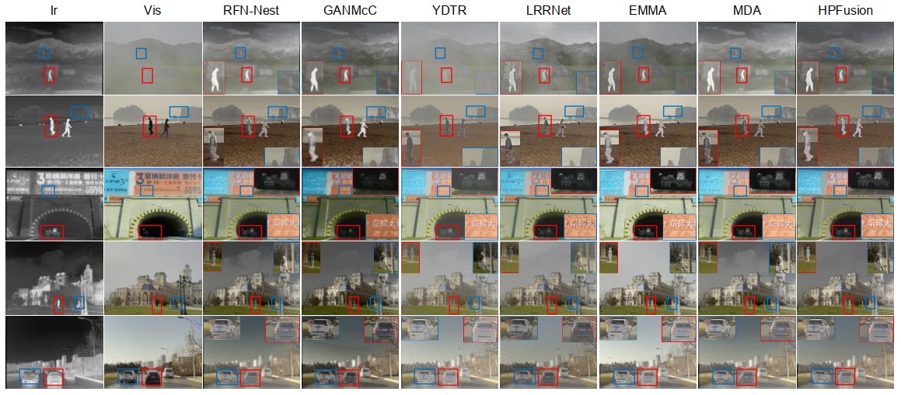

# Code for "Infrared and Visible Image Fusion with Hierarchical Human Perception"

Paper is accepted at [ICASSP 2025](https://arxiv.org/abs/2409.09291)


# Infrared and Visible Image Fusion with Hierarchical Human Perception
>Image fusion combines images from multiple domains into one image, containing complementary information from source domains. Existing methods take pixel intensity, texture and high-level vision task information as the standards to determine preservation of information, lacking enhancement for human perception. We introduce an image fusion method, Hierarchical Perception Fusion (HPFusion), which leverages Large Vision-Language Model to incorporate hierarchical human semantic priors, preserving complementary information that satisfies human visual system. We propose multiple questions that humans focus on when viewing an image pair, and answers are generated via the Large Vision-Language Model according to images. The texts of answers are encoded into the fusion network, and the optimization also aims to guide the human semantic distribution of the fused image more similarly to source images, exploring complementary information within the human perception domain. Extensive experiments demonstrate our HPFusoin can achieve high-quality fusion results both for information preservation and human visual enhancement.

<p align="center">
  
</p>

# Fusion Example

<p align="center">
  
</p>

# 🔧 Dependencies and Installation

* torch==2.1.2
* opencv-python==4.8.0.74

#### Dependent Models

* [llava-v1.6-mistral-7b](https://huggingface.co/liuhaotian/llava-v1.6-mistral-7b)

* [clip-vit-large-patch14-336](https://huggingface.co/openai/clip-vit-large-patch14-336)

If you want to change the pre-trained CLIP model in LLaVA, please set the "mm_vision_tower" to the CLIP folder in the config.json of LLaVA.

## ⚡ Quick Inference

```bash
python test.py
```
